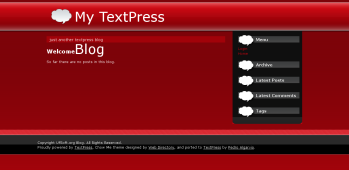

+++
title = "ChowMe TextPress Theme"
slug = "chowme-textpress-theme"
date = 2008-02-25

[taxonomies]
tags = ["TextPress", "TextPress Plugin"]

[extra]
social_media_card = "imgs/social-cards/blog_chowme_textpress_theme.jpg"
+++

This was my first plugin for [TextPress](http://textpress.pocoo.org). A theme to get my old blog looks into [TextPress](http://textpress.pocoo.org).

Here's a preview of it:

It's the theme this blog uses

You can submit bugs and/or new features to [DevNull](http://devnull.ufsoft.org)

[Download It](ChowMeTheme-0.1.plugin)
