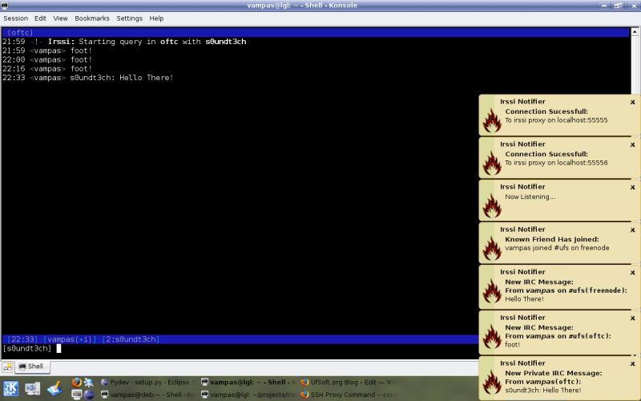

+++
title = "Irssi Notification"
date = 2007-05-10T01:55:00
updated = 2007-09-07
slug = "irssi-notification"
[taxonomies]
categories = ["Linux"]
tags = ["Irssi Notification"]

[extra]
social_media_card = "imgs/social-cards/blog_irssi_notification.jpg"
+++


To make this possible you need the irssi proxy to be configured(find out
how [here](http://www.irssi.org/documentation/proxy), the [libnotify](http://www.galago-project.org/news/index.php) library and its python bindings, the python
[irclib library](http://python-irclib.sourceforge.net), python and optionally, if you’re behind a restrictive
proxy like for example [Squid](http://www.squid-cache.org), an ssh client capable of port forwarding,
more on this later on.



OK, now let's go deep into installing a configuring this baby. Install instructions
will be based on [Kubuntu](http://www.kubuntu.org), my laptop's distribution, but they should work for any
[Debian](http://www.debian.org) based distribution. Let's install the needed dependencies:

```sh
apt-get install libnotify1 python-notify python-gtk2 python-setuptools \
  python-irclib notification-daemon
```

Once the above is finished, you can use setuptools `easy_install` tool to install
Irssi Notifier, so let's install it:

```sh
easy_install IrssiNotifier
```

The above command will install Irssi Notifier into python's site-packages and the
`irssi-notifier` binary into `/usr/bin/`.

Now, until you get your configuration settings right and Irssi Notifier does not
throw you an error do, in case you’ve setup irssi proxy to listen on domain
`example.tld`, port `55555` with the proxy password `Bar` for the nick `Foo`:

```sh
irssi-notifier -P example.tld:55555:Foo -p BAR
```

If the above did not throw error(it shouldn't) then you can write the configuration
to file(defaults to `~/.irssinotification`):

```sh
irssi-notifier -P example.tld:55555:Foo -p BAR -W
```

Now, next time you want to launch Irssi Notifier, you just have to issue:

```sh
irssi-notifier
```

Now, some explanation to what gets written to the configuration file plus some other
available configuration options:

```ini
[main]
passwd = BAR
proxies = example.tld:55555:FOO
timeout = 5
friends = foobar barfoo
```

- **nick** - The common nick used in all defined proxies
- **passwd** - The irssi proxy password
- **proxies** - A space separated list of irssi proxies to listen to
  composed of `<address>:<port>` or `<address>:<port>:<nick>`. If
  you choose the first way to define the proxy you must also provide
  the `nick` configuration variable, that’s the way we know
  messages are addressed to you.
- **timeout** - Timeout in seconds for the pop-up notification to go
  away.
- **friends** - A space separated list of your friends nicks to be
  notified when they join, part, quit or change nicks.

That's about what's needed to run Irssi Notifier.

As a secondary subject for those that, like me, are behind a restrictive
firewall and the only way out is through an http proxy([Squid](http://www.squid-cache.org)), you
still have an option, [OpenSSH](http://www.openssh.com) with [Connect-Proxy](<http://zippo.taiyo.co.jp/[OpenSSH](http://www.openssh.com)gotoh/ssh/connect.html>).

[Connect-Proxy](<http://zippo.taiyo.co.jp/[OpenSSH](http://www.openssh.com)gotoh/ssh/connect.html>) is basically an [OpenSSH](http://www.openssh.com) extension to enable ssh
connections through a proxy server. There's info on how to use the
[Connect-Proxy](<http://zippo.taiyo.co.jp/[OpenSSH](http://www.openssh.com)gotoh/ssh/connect.html>) on
its own page, basicly, in my specific case, I need to connect to the
http proxy and authentication is not required, so I changed my
`~/.ssh/config` and added:

```sshd
ProxyCommand connect-proxy -H <proxy_host>:<proxy_port> %h %p
```

Now, for every ssh connection that command is executed, and that's how
**I**'m able to ssh trough the http proxy. And for irssi notifier,
basically, I establish a tunnel for each irssi proxy connection defined,
for example:

```sh
ssh -L 55555:localhost:55555 user@remote.tld
```

Back to your own usage, now you should instead point Irssi Notifier to
`localhost` instead of the remote host.

```sh
irssi-notifier -P localhost:55555:Foo -p BAR
```

And that's it, I hope you enjoy Irssi-Notification and feel free to
comment on it.

---

**23-05-2007**:

Released a bugfix release, IrssiNotification 0.1.1:

- Fixed a bug regarding private messages notification. Whitin a private
  conversation, even our own messages were beeing notified to us.

**07-09-2007**:

Corrected blog post on the missing dependency and wrong package name,
thanks Markus.
