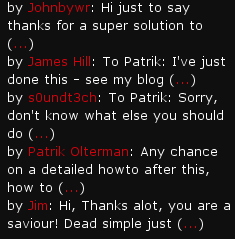

+++
title = "TextPress Extended Last Comments Widget"
date = 2008-02-25T16:22:00
slug = "textpress-extended-last-comments-widget"
[taxonomies]
tags = ["TextPress", "TextPress Plugin"]

[extra]
social_media_card = "imgs/social-cards/blog_textpress_extended_last_comments_widget.jpg"
+++

This is the same as the "Latest Comments" TextPress widget except it
also shows `n` words(configurable) words of each comment.

Not much, but useful.

You can submit bugs and/or new features to [DevNull](http://devnull.ufsoft.org)
