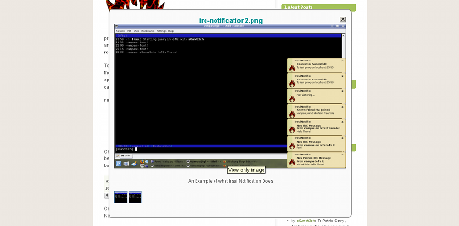

+++
title = "TextPress ImageBox Plugin"
date = 2008-02-25T16:22:00
slug = "textpress-imagebox-plugin"
[taxonomies]
tags = ["TextPress", "TextPress Plugin"]

[extra]
social_media_card = "imgs/social-cards/blog_textpress_imagebox_plugin.jpg"
+++

TextPress jQuery ImgBox plugin support.

Usage:

```html
<span class="imagebox">
  <a href="/_uploads/my_image1.png">
    
  </a>
  <a href="/_uploads/my_image2.png">
    
  </a>
</span>
```

**The needed step is to wrap your series of image links in, for example a** `span` **with the class** `imagebox`.

This way you're image link will be opened by jQuery's ImageBox plugin.



Read more about [jQuery's ImgBox plugin](http://plugins.jquery.com/project/imgbox) and it's usage.

You can submit bugs and/or new features to [DevNull](http://devnull.ufsoft.org)
